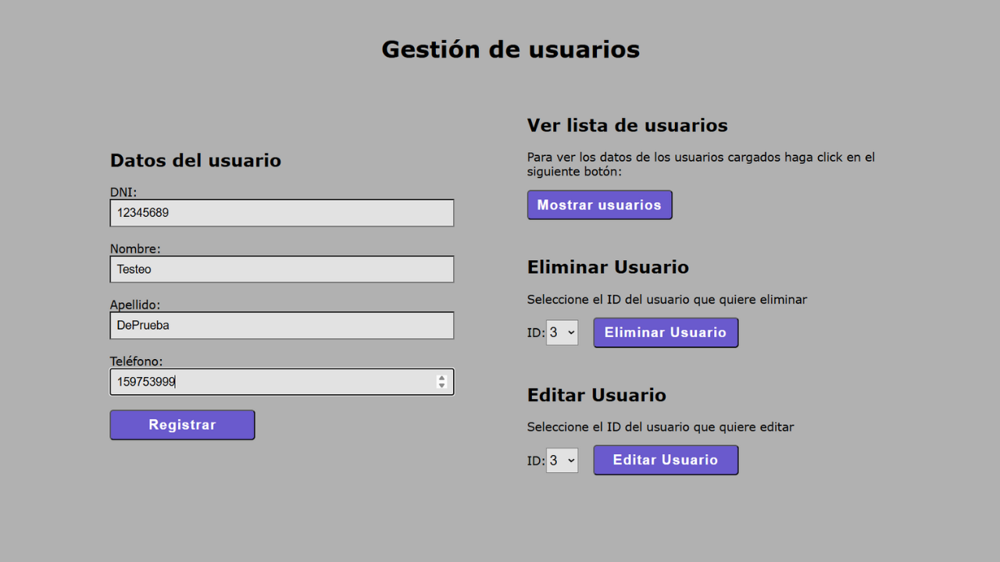
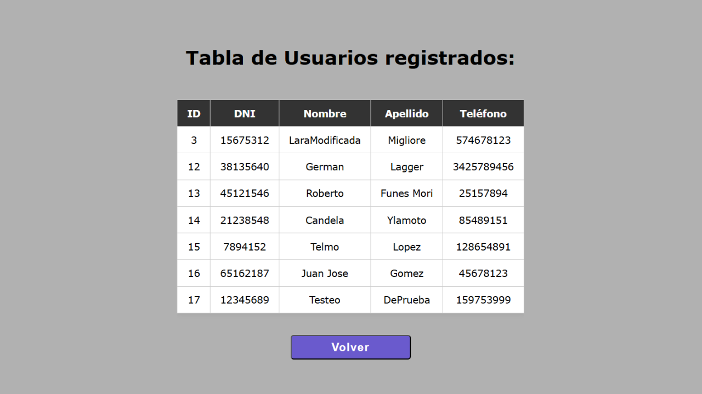
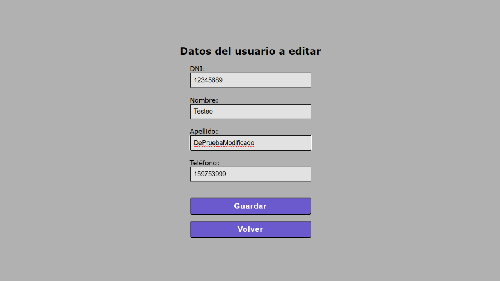

# 👤 Sistema de Gestión de Usuarios con JSP y Servlets

¡Bienvenido a mi proyecto de gestión de usuarios! Esta aplicación web permite registrar, autenticar y administrar información de usuarios a través de una interfaz web sencilla.

## 📖 Descripción

Este proyecto fue desarrollado en **Java utilizando JSP y Servlets**, y emplea **JDBC con MySQL** para la gestión de la base de datos. Está diseñado para reforzar conocimientos en desarrollo web backend con Java.

## 🛠️ Tecnologías utilizadas

- Java 21
- JSP (JavaServer Pages) para la interfaz de usuario
- Servlets para la lógica del servidor
- JDBC para la conexión con la base de datos
- MySQL como sistema de gestión de bases de datos
- Apache Tomcat como servidor de aplicaciones

## 📷 Capturas de pantalla

A continuación, algunas imágenes de la aplicación en funcionamiento:





## 🚀 Cómo ejecutar el proyecto

1. Clonar este repositorio:
   ```sh
   git clone git@github.com:Gherex/Gestion-Usuarios-JSP.git
   ```
2. Importar el proyecto en tu IDE favorito (Eclipse, IntelliJ, NetBeans).
3. Configurar la conexión a la base de datos en el archivo `DBUtil.java` o en el archivo de configuración correspondiente.
4. Asegurarte de tener Apache Tomcat instalado y configurado.
5. Desplegar la aplicación en el servidor Tomcat.
6. Acceder a la aplicación desde tu navegador en `http://localhost:8080/Gestion-Usuarios-JSP`.

## ✍️ Autor

**Germán Lagger**  
- [GitHub](https://github.com/Gherex)
- [LinkedIn](https://www.linkedin.com/in/germanlagger/) 
